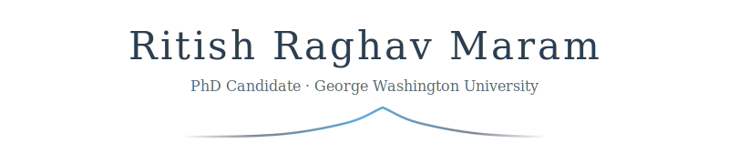

<!-- Multilingual Greeting Animation -->

  

<!-- Header Banner -->

  

<!-- Research Tagline Animation -->

  

 

<!-- Divider -->

  

 

## About

I build adaptive signal processing methods that learn directly from data. My research bridges **classical wavelet theory** with **modern deep learning**, creating tools that preserve the mathematical elegance of wavelets while gaining the flexibility of neural networks.

Currently developing the first open-source MATLAB implementation of learnable wavelet layers — enabling researchers to integrate adaptive multiresolution analysis into their medical imaging pipelines.

 

  

 

## Research Focus

> **Learnable Wavelets for Medical Imaging**
>
> Traditional wavelets use fixed, analytically-defined filters. My approach optimizes wavelet coefficients during training, allowing the decomposition to adapt to specific imaging tasks — whether that's tumor detection in CT, artifact reduction, or feature extraction for radiomics.

**Key Contribution:** First open-source MATLAB implementation bridging wavelet signal processing with deep learning frameworks.

 

  

 

## Featured Work

<table>
<tr>
<td width="50%">

### [Learnable Wavelets (MATLAB)](https://github.com/rrmaram2000/Learnable_Wavelets_Matlab_rrmaram)

Trainable wavelet layers for medical imaging — first open-source MATLAB implementation. Enables adaptive multiresolution analysis with backpropagation-compatible filter learning.

</td>
<td width="50%">

### [Liver Tumor Radiomics](https://github.com/rrmaram2000/liver-tumor-radiomics)

Clinical radiomics analysis pipeline developed in collaboration with NIH. Extracts and analyzes texture features from liver CT scans for tumor characterization.

</td>
</tr>
</table>

 

  

 

## Publications & Talks

📄 **IEEE ISBI 2024** — "Wavelets and Colon Cancer: An Inside Look"

📄 **SPIE Medical Imaging 2026** — *Accepted*

 

  

 

## Credentials

**MathWorks Certified MATLAB Professional** · Image Processing Specialization (MathWorks) · GitHub Copilot Certified

 

  

 

  📧 <a href="mailto:rmaram33@gwu.edu">rmaram33@gwu.edu</a>
  &nbsp;·&nbsp;
  🔗 <a href="https://www.linkedin.com/in/ritish-raghav-maram-863b78155/">LinkedIn</a>
  &nbsp;·&nbsp;
  🏅 <a href="https://www.credly.com/users/ritish-raghav-maram">Credly</a>
  &nbsp;·&nbsp;
  

